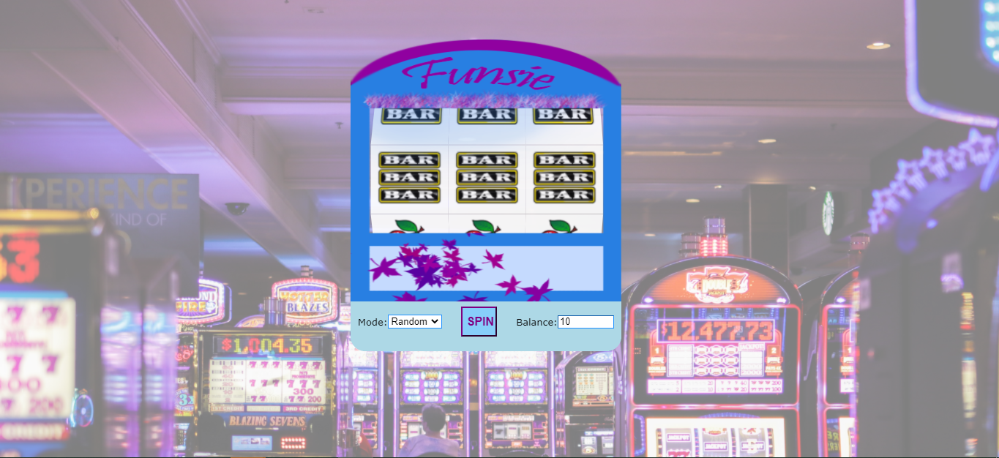
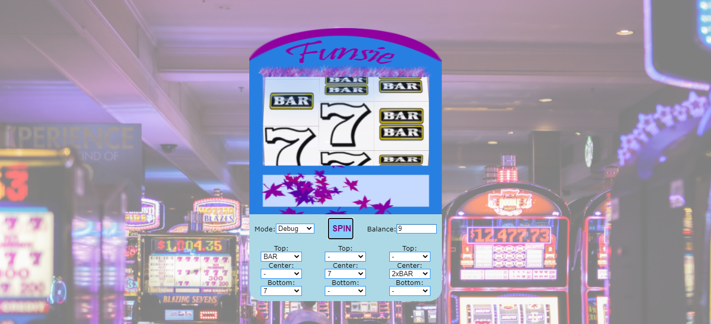
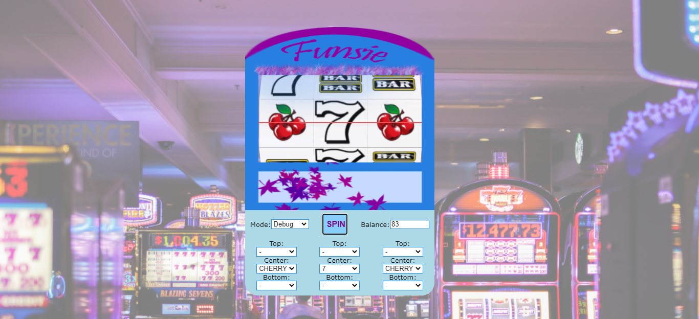

# JavaScript Slot machine with 3 reels

###Instructions
Just open the index.html in Google Chrome.

### Functionalities
* Spin slot machine to random positions
* Spin slot machine using your slot positions
* Pay table calculates the win
* Win line is shown when it occurs
* Balance starts to blink when win occurs
* Each spin costs 1 token
* User can insert amount of tokens up to 5000

In DEBUG mode:
When center element is selected then it overrides top and bottom values.

### Pay-table
* 3 CHERRY symbols on top line 2000
* 3 CHERRY symbols on center line 1000
* 3 CHERRY symbols on bottom line 4000
* 3 7 symbols on any line 150
* Any combination of CHERRY and 7 on any line 75
* 3 3xBAR symbols on any line 50
* 3 2xBAR symbols on any line 20
* 3 BAR symbols on any line 10
* Combination of any BAR symbols on any line 5

| Random Spin     | Debug Spin    | Win Spin   | 
|------------|-------------|-------------|
|  | | |
